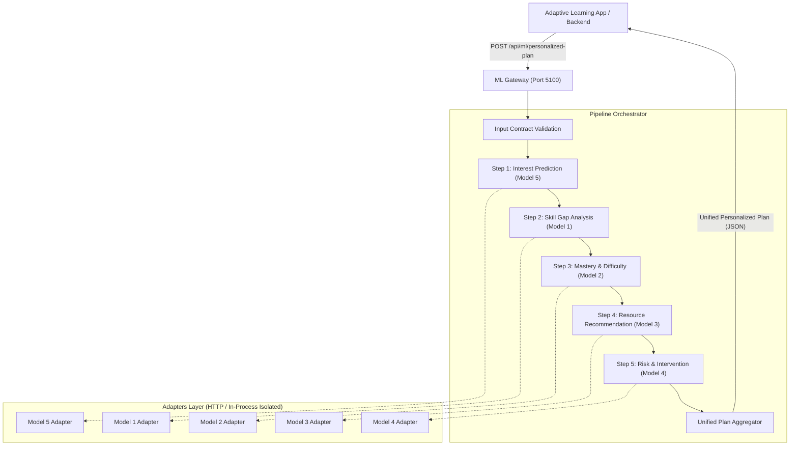
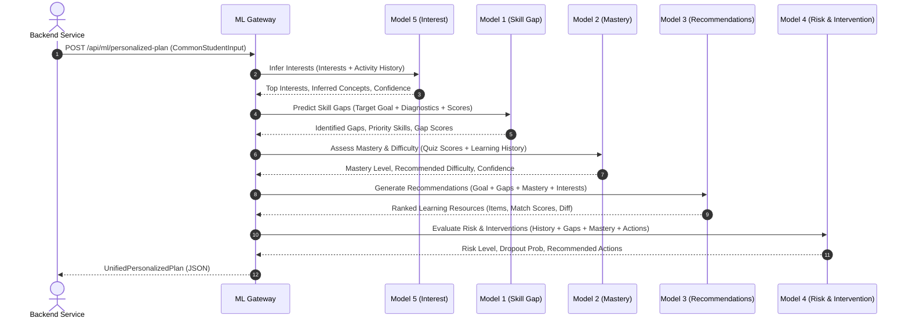

# ML System Architecture Documentation

This document describes the architectural design, execution pipeline, dataflow sequence, and isolation mechanisms powering the **Adaptive Learning Unified ML System**.

---

## 1. High-Level Architectural Design

The system adheres to a **Decoupled Orchestration Gateway Pattern**. Rather than merging independent machine learning models into a single monolithic codebase or altering their pre-trained weights and schemas, an **ML Gateway Orchestrator** coordinates data flow, translates schemas, and normalizes outputs.



---

## 2. Pipeline Sequencing & Dependency Graph

The models operate in a carefully sequenced pipeline where downstream models consume enriched outputs from upstream models:



### Dependency Rationale:
1. **Model 5 (Interest):** Analyzes the raw student interests and behavioral telemetry first to extract inferred topic affinities.
2. **Model 1 (Skill Gap):** Evaluates diagnostic scores against the student's target career role (`Game Developer`) to isolate urgent skill gaps.
3. **Model 2 (Mastery & Difficulty):** Computes granular mastery per skill and specifies the optimal cognitive difficulty tier (`easy`, `medium`, `hard`).
4. **Model 3 (Recommendations):** Feeds both the skill gaps from Model 1, the target difficulty from Model 2, and the interest weights from Model 5 into its graph-based recommendation engine.
5. **Model 4 (Risk & Intervention):** Evaluates overall learning velocity, consecutive failures, skill gaps, and engagement metrics to prescribe proactive interventions.

---

## 3. The Adapters Pattern & Schema Translation

Each model maintains its own native domain model and internal nomenclature:
- Model 1 accepts diagnostic dictionaries with question responses and returns gap lists.
- Model 2 expects feature dictionaries (`quiz_mean`, `attempts`, `consecutive_fails`) and returns categorical strings.
- Model 3 utilizes a domain knowledge graph and expects candidate lists with target roles.
- Model 4 expects tabular feature vectors representing engagement and completion metrics.
- Model 5 expects Pydantic `StudentProfile` and `LearningEvent` models.

The **Adapters Layer** (`ml-gateway/adapters/`) insulates the orchestrator from these idiosyncratic formats:
- Translates `CommonStudentInput` into the model's exact native parameters.
- Normalizes disparate return types into standardized Pydantic contract responses.
- Catches native errors and wraps them into uniform `GatewayException` classes.

---

## 4. Module & Namespace Isolation (`adapters/isolation.py`)

A major engineering challenge in multi-model Python integration is **namespace collision**. Several independent models utilize identical module names:
- `model2` contains `src/`, `config.py`, `schemas/`
- `model3` contains `src/`, `config.py`, `schemas/`
- `model4` contains `src/`, `config.py`
- `Model-1` contains `src/`, `config.py`

When executed in a single Python process, importing `src.predict` from Model 1 would pollute `sys.modules['src']`, causing subsequent imports in Model 2 or Model 3 to fail.

### Solution: Dynamic Module Isolation Context Manager
The Gateway implements `isolate_model_environment(model_dir)`:

```python
@contextmanager
def isolate_model_environment(model_dir: Path):
    collide_names = ("src", "config", "schemas")
    saved_modules = {}

    # 1. Stash and remove colliding modules from sys.modules
    for k in list(sys.modules.keys()):
        if any(k == name or k.startswith(f"{name}.") for name in collide_names):
            saved_modules[k] = sys.modules.pop(k)

    # 2. Swap sys.path to prioritize the active model's directory
    saved_sys_path = list(sys.path)
    model_str = str(model_dir)
    if model_str in sys.path:
        sys.path.remove(model_str)
    sys.path.insert(0, model_str)

    try:
        yield
    finally:
        # 3. Clean up active model's modules and restore stashed modules
        sys.path = saved_sys_path
        for k in list(sys.modules.keys()):
            if any(k == name or k.startswith(f"{name}.") for name in collide_names):
                sys.modules.pop(k, None)
        for k, v in saved_modules.items():
            sys.modules[k] = v
```

This guarantees 100% clean isolation with zero cross-contamination during in-process execution.

---

## 5. Hybrid Microservice & Direct Execution Strategy

The Gateway supports three operational modes via the `MODEL_EXECUTION_MODE` environment variable:

1. **`hybrid` (Default):**
   - The adapter checks if the model's HTTP microservice is running (e.g. `http://127.0.0.1:5001`).
   - If reachable, it delegates inference over HTTP REST.
   - If unreachable or connection is refused, it immediately falls back to direct module execution in-process.
2. **`direct`:**
   - Always executes model inference directly in-process via isolated adapters.
   - Maximum performance (latency ~140ms across all 5 models).
   - Zero background service management required.
3. **`http`:**
   - Strictly enforces external HTTP microservice calls.
   - Returns a structured `MODEL_UNAVAILABLE` error if any model service is offline.

---

## 6. Resilience & Failure Handling

The ML Gateway ensures graceful failure containment:
- **Upstream Failures:** If Model 5 (Interests) is degraded, Model 1 and Model 2 continue uninterrupted using fallback student preferences.
- **Model 1 / Model 2 Fallbacks:** If diagnostic data is incomplete, Model 3 uses default foundational competencies to generate safe recommendations.
- **Structured Error Responses:** All API errors adhere to a standardized contract:
  ```json
  {
    "model": "model1",
    "error_code": "MODEL_UNAVAILABLE",
    "message": "Model 1 is currently offline and unreachable.",
    "retryable": true,
    "details": {"endpoint": "http://127.0.0.1:5001"}
  }
  ```
